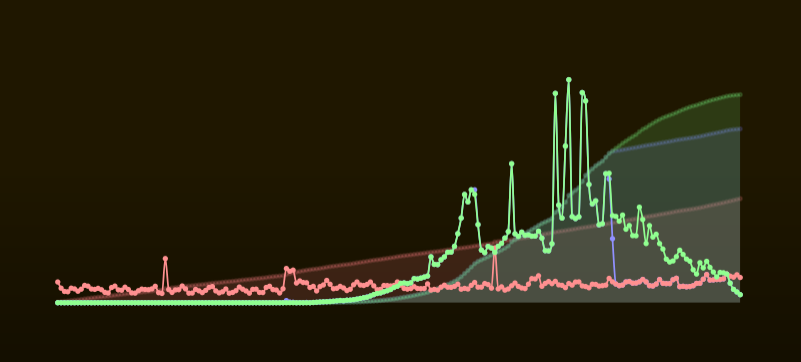

# MMM-PVoutput

PVOutput module for MagicMirror

## Heavily changed:

- Now using https://www.chartjs.org to create the chart
- Now using the `#http_fetcher` from the base to fetch the data


## Installation

Clone this repository in your modules folder, and install dependencies:

```bash
cd ~/MagicMirror/modules
git clone https://github.com/mw46d/MMM-PVoutput.git
cd MMM-PVoutput
npm install  --omit=dev
```


## Configuration

Go to the MagicMirror/config directory and edit the config.js file.
Add the module to your modules array in your config.js.

Enter as minimimum  your `sid` & `apiKey` in the config.js for your MagicMirror installation.
The other options have reasonable defaults.


```js
{
    module: 'MMM-PVoutput',
    position: 'lower_third',
    config: {
        sid: <Your pvoutput SystemID>,
        apiKey: "<Your pvoutput.org api Key>",

        lineWidth: 1,
        pointRadius: 1,
        displayLegend: false,
        displayScales: false,
        showConsumption: true,
        extData: true,
        generationPowerLineColor: "#90ff90",
        generationEnergyFillColor: "rgba(100, 200, 100, 0.2)",
        consumptionPowerLineColor: "#9090ff",
        consumptionEnergyFillColor: "rgba(100, 100, 200, 0.2)",
        homePowerLineColor: "#ff9090",
        homeEnergyFillColor: "rgba(200, 100, 100, 0.2)",
        maxPower: 10000,
        width: "400px",
        height: "150px",
        posRight: null,
        posDown: null,
        updateInterval: 5 * 60 * 1000, // Milliseconds between refreshes
    }
}
```


## An example graph from my sytem on a cloudy day



- Green are the generated power & energy
- Blue are the 'used' power & energy. They include the charging of the
  battery. The power line is mostly hidden behind the 'generation power'
  until the battery is completely charged.
- Red are the actual usage power & eneregy of the home. They use
  extented data points for PVoutput, so they would only be available
  with a donation-account. I'm using v7 for the 'home power' and v12 for
  the 'home energy'.
